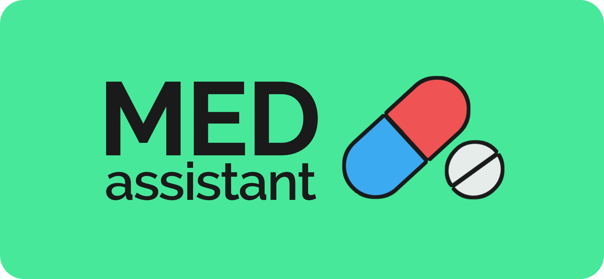
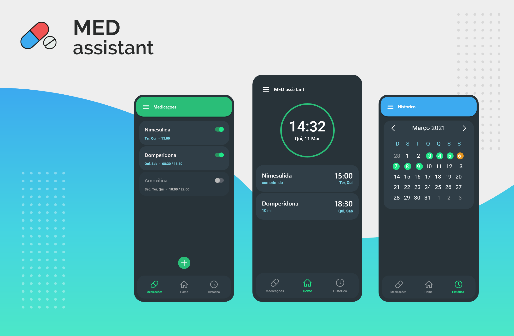

# MED Assistant

## 🛠 Prévia

<b>MED ASSISTANT</b> é um aplicativo gratuito disponível na 
plataforma de vendas da Play store. O objetivo do aplicativo é 
ser utilizado como um assistente com o controle das suas 
medicações, dando a hora exata que o usuário deve tomar suas 
medicações.

---

## 💻 Dados

Nossa aplicação vai ser construida em dart usando como principal ferramenta o flutter.

<b>git clone:</b> https://github.com/fga-eps-mds/MDS-2020-2-G9.git

Vídeo ajuda para instalar o ambiente de trabalho.

<b>Vídeo flutter:</b> https://www.youtube.com/watch?v=9m3PvcQ18Hk&t=73s

---

## ⚙️ Funcionalidades

- Os usuários com acesso ao aplicativo móvel, poderão:
  - cadastrar um medicamento respectivamente junto ao horário à ser tomada a medicação.
  - navegar entre os dias em que a medicação foi tomada no horário adequado, ou se não foi tomada a medicação aquele dia;
  - deletar ou alterar qualquer informação sobre o medicamento ou seu horário;

---

## 🎨 Layout

---

## Apresentação

<b>Slides :</b> https://docs.google.com/presentation/d/1hG5Rirlpc9o5VA5o8gxl5AWCEoui_iAno6OKQUu4aIw/edit#slide=id.g35ed75ccf_022

<b>Vídeo :</b> https://www.youtube.com/watch?v=55HeVJXf7L4&t=5s&ab_channel=Jo%C3%A3oVictorValad%C3%A3o

---

## Integrantes

|**Nome**|**Email**|
|:-|:-|
Joao Victor Valadão|joaovaladao161274@gmail.com
Ítalo Serra|italoserra99@gmail.com
Gabriel Avelino|	blackzinh8@gmail.com
Christian Fleury|	chfleurysiq@gmail.com
Vinícius Roriz|viniciusroriz21@gmail.com
Thiago Gomes|	thiagosiqgomes@gmail.com
